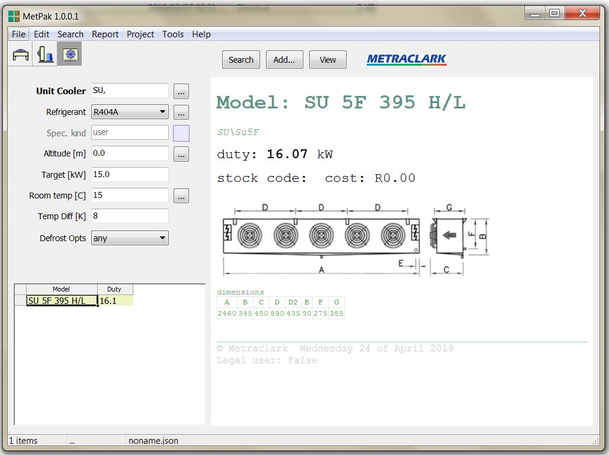

# Created : 24/04/2019 / Author - N du Plessis
#### Last Updated : 24/04/2019 / Author - N du Plessis

##  #19 **_Unit Cooler Tolerance Algorithm_**

**Issue:** In certain selection criterias, only one unit is displayed instead of multiple units.

**Result:** Algorithm to be checked to ensure at least 3 options are avaialble, even if one option is lower than the required capacity

