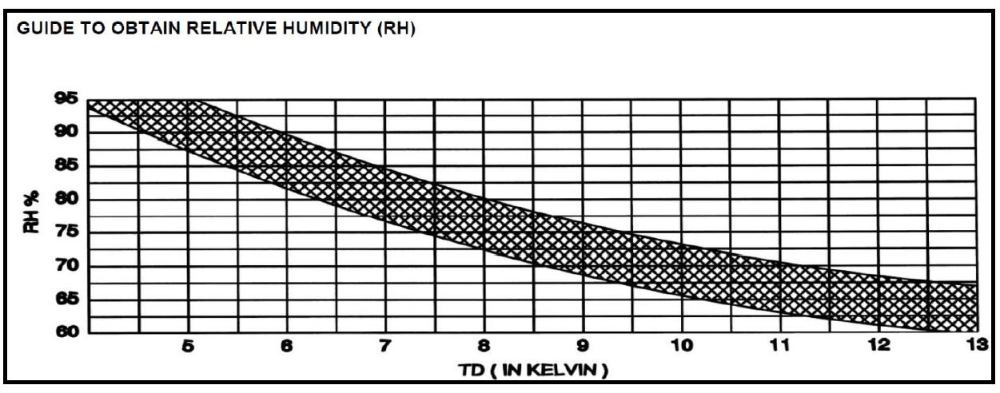

# Created : 24/04/2019 / Author - N du Plessis
#### Last Updated : 24/04/2019 / Author - N du Plessis

##  #20 **_RH% to be based on delta T_**

**Issue:** Remove the Psy Spec to determine wb and db conditions and base selections on delta T, which correlates to RH%

**Result:** Diagram depicts the RH% compared to the delta T of the unit. 

Delta T being the difference between the required room temperature and the designed suction temperature.

