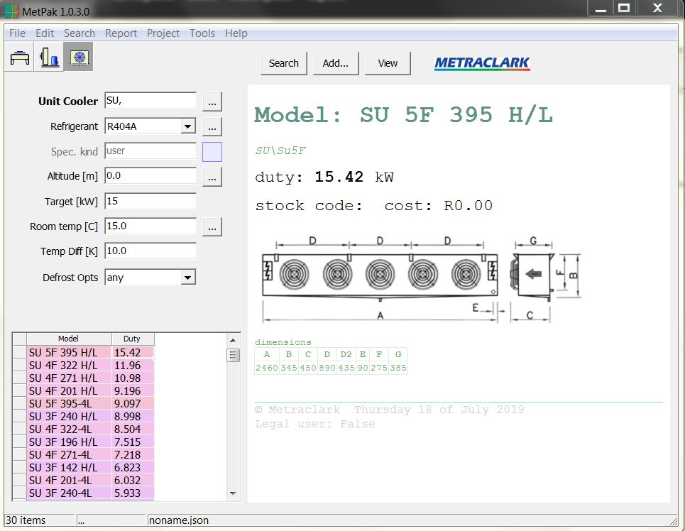

# Created : 18/07/2019 / Author - N du Plessis
#### Last Updated : 18/07/2019 / Author - N du Plessis

##  #21 **_Unit cooler capacity under valued_**

**Issue:** Unit cooler value displayed is lower than the catalogue stated value

**Result:** Adjust the value to get closer to the actual value 

